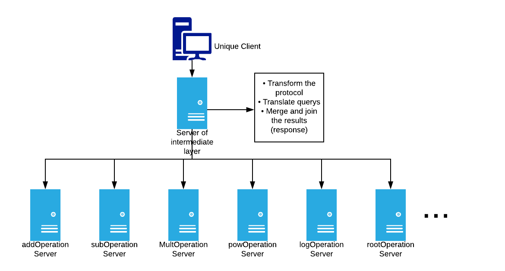

## Readme File - Exercise 2

### Operations supported

| Operation | Symbol |
| ------ | ------ |
| Add | + |
| Sub | - |
| Multiplication | * |
| Division | / |
| Pow | ^ |
| Log | log |
| Root | root |

### Architecture

[]