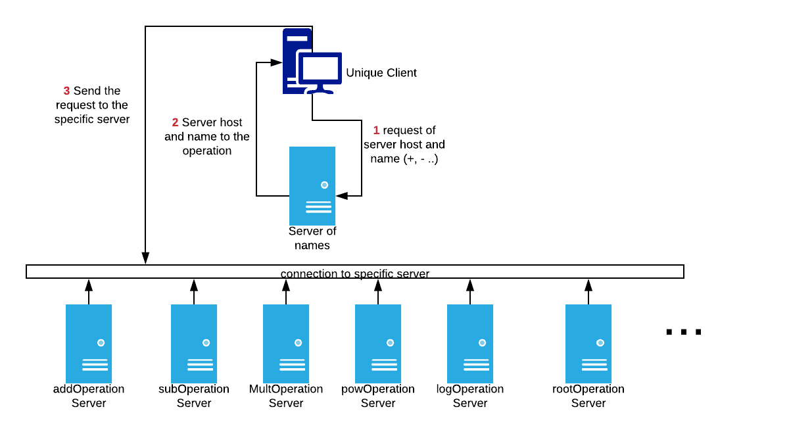

# Readme File - Exercise 3

## Description

We have a client that requires an operation, he send a request to a **server of names** to get the **host and the port** of the server that have the operation that he requires.

## Operations supported

| Operation | Symbol |
| ------ | ------ |
| Add | + |
| Sub | - |
| Multiplication | * |
| Division | / |
| Pow | ^ |
| Log | log |
| Root | root |

## Architecture

